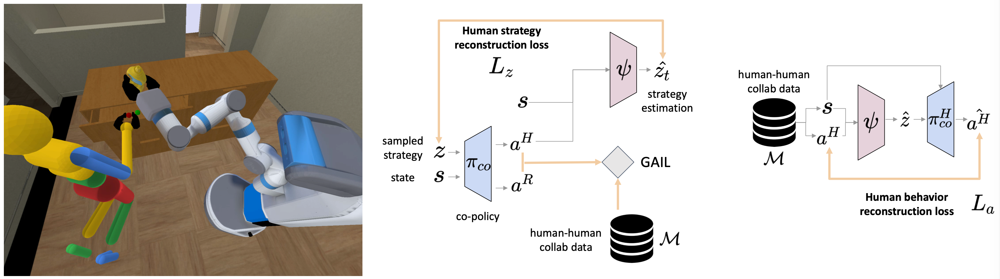

# CoGAIL

<p align="center">
	
</p>

## Table of Content
- [Overview](#overview)
- [Installation](#installation)
- [Dataset](#dataset)
- [Training](#training)
- [Evaluation](#evaluation)
- [Trained Checkpoints](#trained-checkpoints)
- [Acknowledgement](#acknowledgement)
- [Citations](#citations)
- [License](#license)

## Overview

This repository is the implementation code of the paper "Co-GAIL: Learning Diverse Strategies for Human-Robot Collaboration"([arXiv](https://arxiv.org/abs/2108.06038), [Project](https://sites.google.com/view/cogail/home), [Video](https://drive.google.com/file/d/1m-N2LF8RMYXFGpCDgpEm0aBBBFu0lG-o/view)) by Wang et al. at [Stanford Vision and Learning Lab](http://svl.stanford.edu/). In this repo, we provide our full implementation code of training and evaluation.

## Installation
* python 3.6+
```	
conda create -n cogail python=3.6
conda activate cogail
```

* iGibson 1.0 variant version for co-gail. For more details of iGibson installation please refer to [Link](http://svl.stanford.edu/igibson/docs/installation.html)
```	
git clone https://github.com/j96w/iGibson.git --recursive
cd iGibson
git checkout cogail
python -m pip install -e .
```
Please also download the assets of iGibson (models of the objects, 3D scenes, etc.) follow the [instruction](http://svl.stanford.edu/igibson/docs/installation.html#downloading-the-assets). The data should be located at `your_installation_path/igibson/data/`. After downloaded the dataset, copy the modified robot and humanoid mesh file to this location as follows
```	
cd urdfs
cp fetch.urdf your_installation_path/igibson/data/assets/models/fetch/.
cp camera.urdf your_installation_path/igibson/data/assets/models/grippers/basic_gripper/.
cp -r humanoid_hri your_installation_path/igibson/data/assets/models/.
```

* other requirements
```	
cd cogail
python -m pip install -r requirements.txt
```

## Dataset
You can download the collected human-human collaboration demonstrations for [Link](https://drive.google.com/drive/folders/1sz0M6hi9NAaUlQevuwvg6K0NpNwwBvH3?usp=sharing). The demos for `cogail_exp1_2dfq` is collected by a pair of joysticks on an xbox controller. The demos for `cogail_exp2_handover` and `cogail_exp3_seqmanip` are collected with two phones on the teleoperation system [RoboTurk](https://roboturk.stanford.edu/). After downloaded the file, simply unzip them at `cogail/` as follows
```	
unzip dataset.zip
mv dataset your_installation_path/cogail/dataset
```

## Training

There are three environments (`cogail_exp1_2dfq`, `cogail_exp2_handover`, `cogail_exp3_seqmanip`) implemented in this work. Please specify the choice of environment with `--env-name`
```	
python scripts/train.py --env-name [cogail_exp1_2dfq / cogail_exp2_handover / cogail_exp3_seqmanip]
```

## Evaluation

Evaluation on unseen human demos (replay evaluation):
```
python scripts/eval_replay.py --env-name [cogail_exp1_2dfq / cogail_exp2_handover / cogail_exp3_seqmanip]
```

## Trained Checkpoints
You can download the trained checkpoints for all three environments from [Link](https://drive.google.com/drive/folders/1sz0M6hi9NAaUlQevuwvg6K0NpNwwBvH3?usp=sharing).


## Acknowledgement
The `cogail_exp1_2dfq` is implemented with [Pygame](https://www.pygame.org/news). The `cogail_exp2_handover` and `cogail_exp3_seqmanip` are implemented in [iGibson v1.0](http://svl.stanford.edu/igibson/).

The demos for robot manipulation in iGibson is collected with [RoboTurk](https://roboturk.stanford.edu/).

Code is based on the PyTorch GAIL implementation by ikostrikov (https://github.com/ikostrikov/pytorch-a2c-ppo-acktr-gail.git).

## Citations
Please cite [Co-GAIL](https://sites.google.com/view/co-gail-web/home) if you use this repository in your publications:
```
@article{wang2021co,
  title={Co-GAIL: Learning Diverse Strategies for Human-Robot Collaboration},
  author={Wang, Chen and P{\'e}rez-D'Arpino, Claudia and Xu, Danfei and Fei-Fei, Li and Liu, C Karen and Savarese, Silvio},
  journal={arXiv preprint arXiv:2108.06038},
  year={2021}
}
```

## License
Licensed under the [MIT License](LICENSE)
